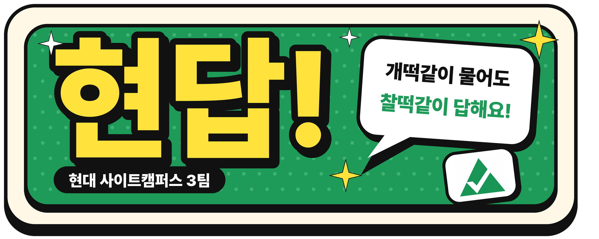

 

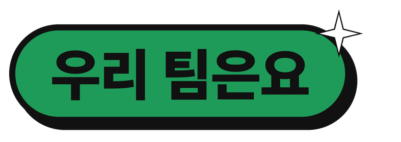

## 우문현답, 우리들의 거친 문제도 현대의 답으로

현업에서 실무를 하다 보면 늘 완벽한 질문만 던질 수는 없습니다.
현장의 거칠고 두서없는 질문, **개떡같이 묻는 질문**이라도 **찰떡같은 현대(Hyundai)의 답**으로 돌려주는 AI 플랫폼을 만드는 팀, **현답**입니다.

### 전공자는 없지만, 화이팅은 넘칩니다.
### AI 에이전트와 함께 하루하루 강의를 견뎌내고 있습니다.

 

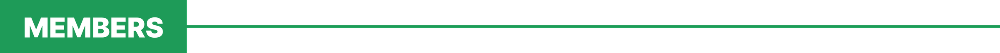

<table>
  <tr>
    <td align="center" colspan="3">
      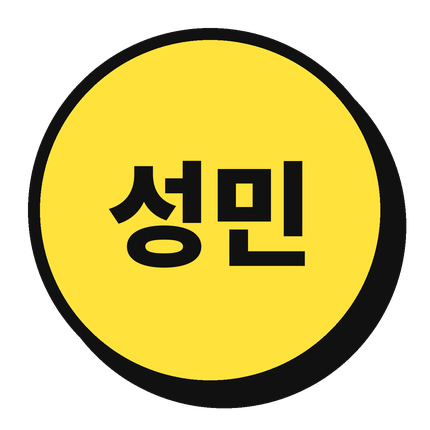 
      <h2>이성민</h2>
      <h3>팀장</h3>
      <b>배경</b> 작성 예정 
      <b>한마디</b> 작성 예정 
      <b>맡은 일</b> 작성 예정 
      <b>관심사</b> 작성 예정
    </td>
  </tr>
  <tr>
    <td align="center" width="33%">
      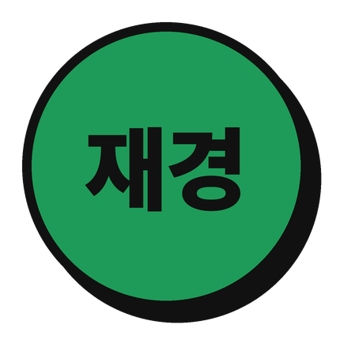 
      <h2>전재경</h2>
      <b>배경</b> 작성 예정 
      <b>한마디</b> 작성 예정 
      <b>맡은 일</b> 작성 예정 
      <b>관심사</b> 작성 예정
    </td>
    <td align="center" width="33%">
      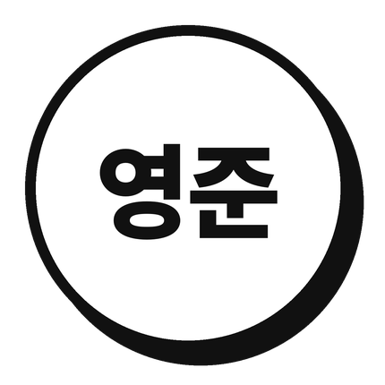 
      <h2>박영준</h2>
      <b>배경</b> 작성 예정 
      <b>한마디</b> 작성 예정 
      <b>맡은 일</b> 작성 예정 
      <b>관심사</b> 작성 예정
    </td>
    <td align="center" width="33%">
      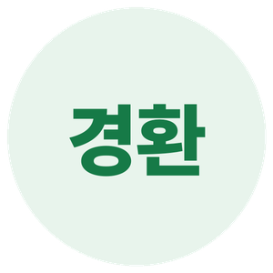 
      <h2>박경환</h2>
      <b>배경</b> 작성 예정 
      <b>한마디</b> 작성 예정 
      <b>맡은 일</b> 작성 예정 
      <b>관심사</b> 작성 예정
    </td>
  </tr>
  <tr>
    <td align="center" width="33%">
      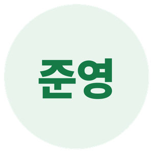 
      <h2>이준영</h2>
      <b>배경</b> 작성 예정 
      <b>한마디</b> 작성 예정 
      <b>맡은 일</b> 작성 예정 
      <b>관심사</b> 작성 예정
    </td>
    <td align="center" width="33%">
      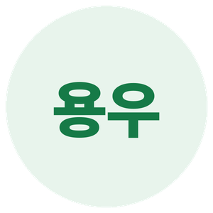 
      <h2>소용우</h2>
      <b>배경</b> 작성 예정 
      <b>한마디</b> 작성 예정 
      <b>맡은 일</b> 작성 예정 
      <b>관심사</b> 작성 예정
    </td>
    <td align="center" width="33%">
      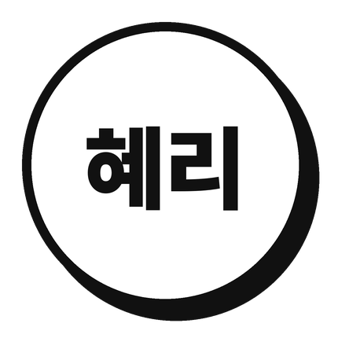 
      <h2>김혜리</h2>
      <b>배경</b> 작성 예정 
      <b>한마디</b> 작성 예정 
      <b>맡은 일</b> 작성 예정 
      <b>관심사</b> 작성 예정
    </td>
  </tr>
</table>

 

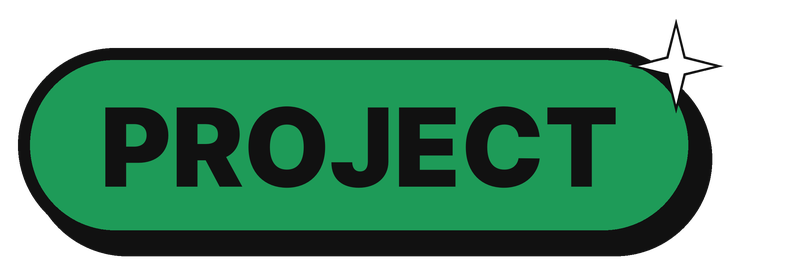

## 업무·기술 매뉴얼 기반 AI 지식 탐색 및 요약 서비스

우리가 맡은 세부 주제는 **다중 기업 문서 검색 플랫폼**입니다.
기업별로 흩어진 문서를 **공통 구조로 정리**하고, **하나의 화면에서 검색**합니다.

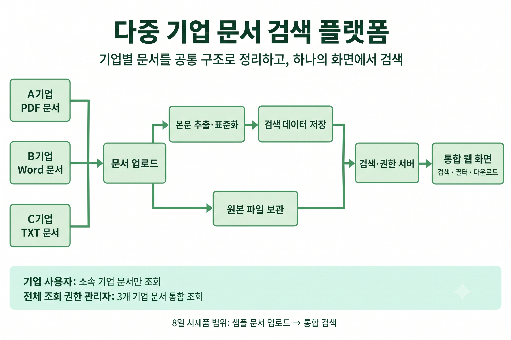

### 챗봇이 아니라 검색 플랫폼입니다

실무자는 모호한 대화형 답변보다 **원하는 데이터가 어떤 문서의 몇 페이지, 어떤 표에 있는지** 바로 확인하고 다운로드할 수 있는 도구를 원합니다.

| 영역 | 보여주는 것 |
|---|---|
| **왼쪽 AI 요약** | 3~5줄 두괄식 답변, 단계별 번호 매김, 규격과 단가는 표(Table) 카드로 |
| **오른쪽 근거 카드** | 기업과 문서 종류 배지, 본문 매칭 스니펫, 원본 다운로드 |
| **다중 기업 교차 검색** | 질문 하나에 여러 기업의 문서가 나란히 출처 카드로 |
| **권한 구분** | 기업 사용자는 소속 기업 문서만, 전체 조회 관리자는 3개 기업 통합 조회 |
| **환각 방어** | 모든 답변을 원본 문서 근거와 1:1로 연결 |

 

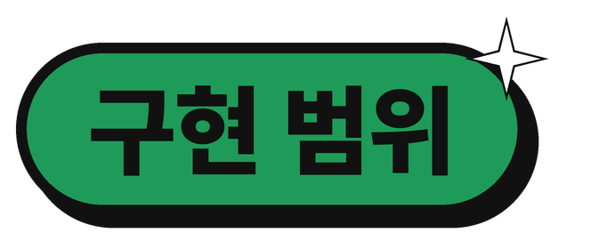

## 8일 안에 되는 것부터 확실하게

아직 브레인스토밍 단계라 확정된 내용은 아닙니다.

| 단계 | 기능 |
|:---:|---|
| **MVP** | 두 패널 레이아웃, AI 요약 답변, 단계별 번호 출력, 마크다운 표 카드, 기업별 태그 배지, 본문 스니펫, 원본 다운로드 |
| **도전** | 검색어 노란색 하이라이트, 카테고리 선택 후 검색, 권한 설정 |
| **확장** | 원클릭 PDF 뷰어, 특정 페이지(예: p.45) 바로 열기 |

 

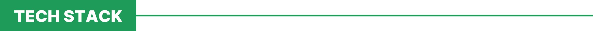

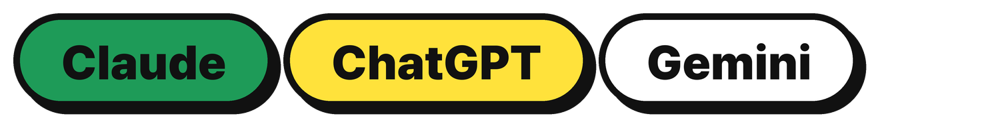

전공자는 없지만 AI 에이전트가 함께합니다.

 

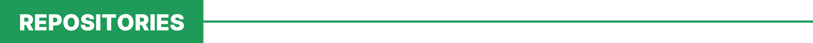

### [demo-repository](https://github.com/hyundaisightcampus3/demo-repository)
